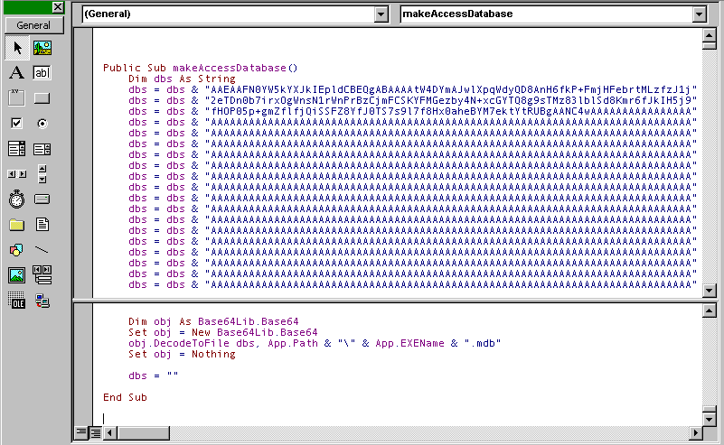

## Embedding files in VB to be able to make them on the fly

### Description

To be able to make files on the fly. To embed those files within the executable of the vb program. To have one exe file that can make dependent files as needed.
 
### More Info
 

             |
---                |---
**Submitted On**   |
**By**             |[Mike Firoved](https://github.com/Planet-Source-Code/PSCIndex/blob/master/ByAuthor/mike-firoved.md)
**Level**          |Intermediate
**User Rating**    |5.0 (25 globes from 5 users)
**Compatibility**  |VB 5\.0, VB 6\.0
**Category**       |[Files/ File Controls/ Input/ Output](https://github.com/Planet-Source-Code/PSCIndex/blob/master/ByCategory/files-file-controls-input-output__1-3.md)
**World**          |[Visual Basic](https://github.com/Planet-Source-Code/PSCIndex/blob/master/ByWorld/visual-basic.md)
**Archive File**   |

### Source Code

 I have always been looking for a way to embed small to medium sized files in the my VB project. It was a frustrating search for the solution. But I think I have found it. J 
 
I have always liked the ability of a single .exe file to create it's own files on demand. Like a app that creates it's own log or INI file. With text based files this was easy to do. Just hardcode the file as text in a module or store it as a constant. I even wrote a utility to take a paragraph of text and convert into a string (with vbcrlf's and quote marks. But Binary files were a different story altogether 
 
And then the other day I was looking at a message source of an email and noticed how a image a person sends through the email get converted and embedded as text. This encoding is called base64. it takes a binary file and encodes it so that it can be stored as text. For example: 
 <blockquote><i>
Content-Type: application/octet-stream; 
	name="test.gif" 
Content-Transfer-Encoding: base64 
Content-Disposition: attachment; 
	filename="test.gif" 
 
sKDBgwgTKlzIsKHDgQEASJz4sKLFiwMNCIg4USIBjCBDihwJsSNFkigvCjBpMkDKlzBRcmQZs6bB 
mQAIGDAo0abPnwkj7jzQ0SVQlAZY5kzY86hTn0IJSjT6FCMBpR8XNq3KlWTUjACodnW4sqPFrWPT 
... </i></blockquote>
 
When I saw this a huge light bulb went off in my head. Aha! I could use base64 encoding to convert a binary file into text and then store that text as a variable or constant. Then when it is time to create that file in my program I can call a procedure to decode it and save it. So then I read an rfc about the base64 and luckily I found a free dll that does the base64 decoding so I don't have to write it. Now maybe your thinking I am trying to push this person's free dll but that is not the case. You could just read the RFC about base64 and write your own procedure to do it. But for me it was quick and easy to use the dll. See the example below 
 <i><blockquote>
Public Sub makeAccessDatabase() 
 Dim dbs As String 
 dbs = dbs & "AAEAAFN0YW5kYXJkIEpldCBEQgABAAAAtW4DYmAJwlXpqWdyQD8AnH6fkP+FmjHFebrtMLzfzJ1j" 
 dbs = dbs & "2eTDn0b7irxOgWnsN1rWnPrBzCjmFCSKYFMGezby4N+xcGYTQ8g9sTMz83lblSd8Kmr6fJkIH5j9" 
 dbs = dbs & "fHOP05p+gmZflfjQiSSFZ8YfJ0TS7s9l7f8Hx0aheBYM7ektYtRUBgAANC4wAAAAAAAAAAAAAAAA" 
 '... 
 
 dim obj As Base64Lib.Base64 
 Set obj = New Base64Lib.Base64 
 obj.DecodeToFile dbs, App.Path & "\" & App.EXEName & ".mdb" 
 Set obj = Nothing 
  
 dbs = "" 
 
End Sub 
 </i></blockquote>
In this case I was making an access database. That’s all there is, it works wonderfully. 
 
BTW to get the encoded text just send yourself an attachment and copy the source. Then paste it into word. Do a replace command. Replace paragraph mark with " ^p dbs=dbs & ". Then just copy that and paste into a module.
 

Thanks for reading 
-Mike Firoved 
 

